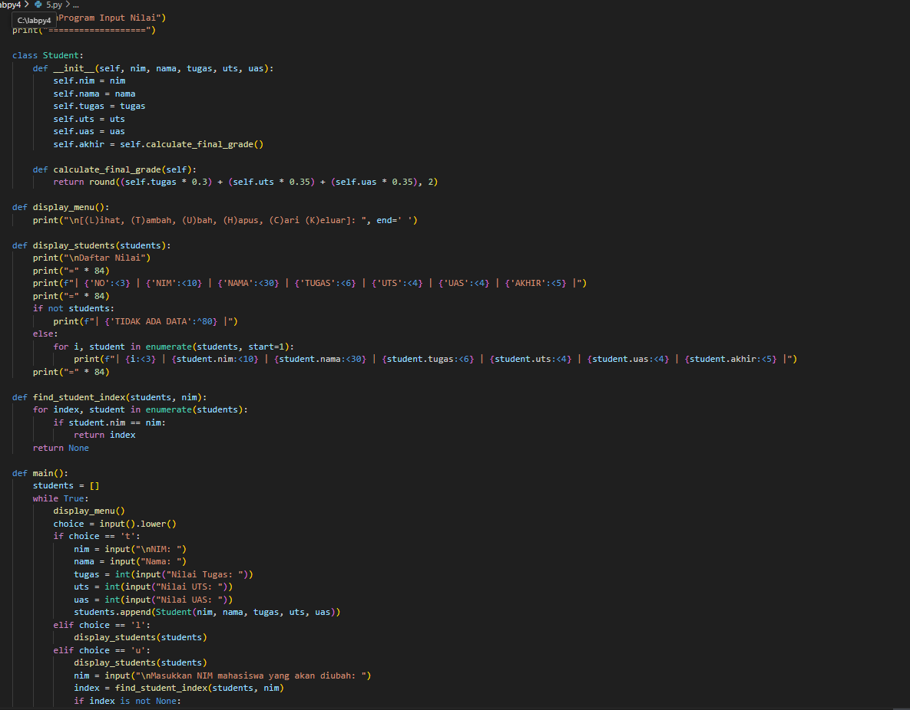
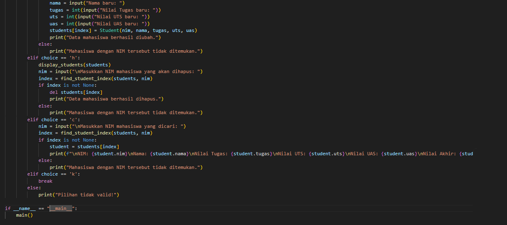
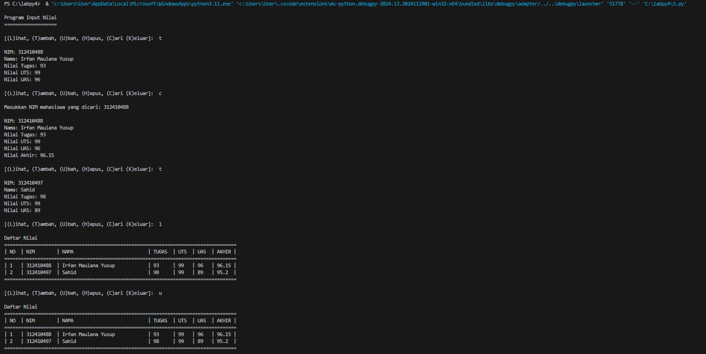
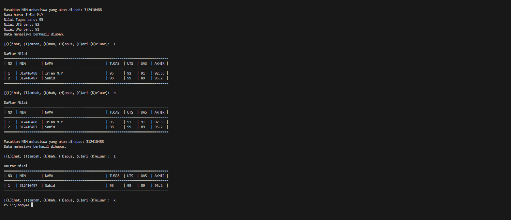

# labpy05
Nama : Irfan Maulana Yusup <p>
NIM : 312410488 <p>
Kelas : TI.24.A.5 <p>
Mata kuliah : Bahasa Pemrograman <p>
# ```Program Input Nilai```
## Flowchart

## Code Program


### Penjelasan Program
1. Penjelasan Header dan Kelas Student
   - class student: Kode ini mencetak judul program dan mendefinisikan kelas Student yang memiliki atribut nim, nama, tugas, uts, uas, dan akhir.

   - calculate_final_grade adalah metode yang menghitung nilai akhir berdasarkan bobot tugas (30%), UTS (35%), dan UAS (35%).

2. Penjelasan Fungsi Menampilkan Menu dan Daftar Mahasiswa
   - display_students menampilkan daftar nilai mahasiswa dalam format tabel. Jika tidak ada data, pesan "TIDAK ADA DATA" akan ditampilkan.

3. Penjelasan Fungsi Mencari Indeks Mahasiswa
   - find_student_index mencari indeks mahasiswa berdasarkan NIM. Mengembalikan None jika NIM tidak ditemukan.

4. Penjelasan Fungsi Utama
   - Fungsi main adalah fungsi utama yang menjalankan program.
   - Variabel students menyimpan daftar objek Student.
   - Program menampilkan menu dan menangani pilihan pengguna:
     - Tambah (t): Menambah data mahasiswa baru ke dalam daftar students.
     - Lihat (l): Menampilkan daftar mahasiswa.
     - Ubah (u): Mengubah data mahasiswa berdasarkan NIM yang diberikan. Jika NIM ditemukan, data mahasiswa diperbarui dengan data baru.
     - Hapus (h): Menghapus data mahasiswa berdasarkan NIM yang diberikan. Jika NIM ditemukan, data mahasiswa dihapus dari daftar students.
     - Cari (c): Mencari dan menampilkan data mahasiswa berdasarkan NIM yang diberikan. Jika NIM ditemukan, data mahasiswa ditampilkan.

Keluar (k): Keluar dari program
## Output Program


